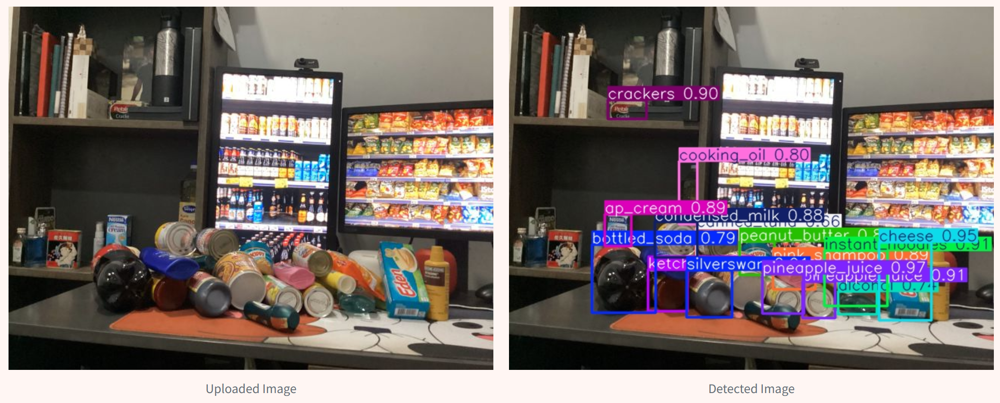
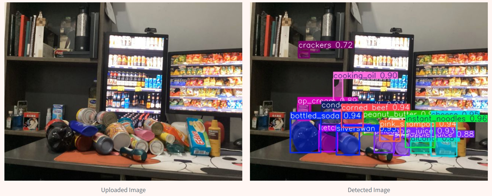

# Image Segmentation Web App

Web application that performs object detection and segmentation on common grocery items.

## Pages

| Page         | Contents                                                                                                                                                           |
|--------------|-------------------------------------------------------------------------------------------------------------------------------------------------------------------|
| Home         | Provides details about the grocery items used in the dataset and allows users to explore sample images with annotations for each class.                          |
| Model Cards  | Showcases model details, including training parameters, validation metrics, and the models selected for deployment in this application.                           |
| Inference    | Offers a guide on performing inference, presents tested sample images and videos, and allows users to test the models using custom images, videos, or a live webcam stream. |

## Demo

The deployed version of this project can be accessed at [Grocery Items Detection and Segmentation App](https://grocery-detection-segmentation-webapp.streamlit.app/). 

Sample results are shown below:
<details open>
<summary>Detection and Segmentation via Image</summary>

### Detection


### Segmentation


</details>

<details open>
<summary>Detection and Segmentation via Video</summary>

### Detection


### Segmentation


</details>

## Dataset

The dataset used to train the model comprises 24 classes of common grocery items found in the Philippines. These images were manually collected and annotated by the AI 231 class of UP Diliman (AY 2024–2025). To ensure the model's robustness, the dataset includes images captured under various environmental conditions, such as nighttime, daytime, and obstructed views.

<details open>
<summary>Image Dataset Summary</summary>

| #   | Class              | Training Images | Validation Images | Total Images | Specific Brand/Variation                 | Unit of Measurement per Instance            |
|-----|--------------------|-----------------|-------------------|--------------|------------------------------------------|---------------------------------------------|
| 1   | Bottled Soda       | 477             | 58               | 535          | Coca-Cola (Coke Zero)                    | 1.9L bottle, 320mL bottle                   |
| 2   | Cheese             | 310             | 40               | 350          | Eden (Classic)                           | 165g box, 45g pack                          |
| 3   | Chocolate          | 459             | 59               | 518          | KitKat (Chocolate)                       | 36.5g pack                                  |
| 4   | Coffee             | 404             | 41               | 445          | Nescafe Original (Classic)               | 52g twin pack, 28g pack                     |
| 5   | Condensed Milk     | 370             | 46               | 416          | Alaska (Classic)                         | 208g can                                    |
| 6   | Cooking Oil        | 467             | 55               | 522          | Simply Canola Oil                        | 1L bottle                                   |
| 7   | Corned Beef        | 442             | 58               | 500          | Purefoods (Classic, Spicy)               | 150g, 210g, 380g can                        |
| 8   | Garlic             | 317             | 33               | 350          | Whole                                    | Whole                                       |
| 9   | Instant Noodles    | 431             | 42               | 473          | Lucky Me! (Sweet and Spicy)              | 80g pack                                    |
| 10  | Ketchup            | 477             | 47               | 524          | UFC (Banana)                             | 530g                                        |
| 11  | Lemon              | 324             | 38               | 362          | Whole                                    | Whole                                       |
| 12  | All-purpose Cream  | 451             | 49               | 500          | Nestle (Classic)                         | 250g box                                    |
| 13  | Mayonnaise         | 319             | 31               | 350          | Lady's Choice (Classic)                  | 700mL bottle                                |
| 14  | Peanut Butter      | 485             | 35               | 520          | Lady's Choice, Skippy                    | 170g, 340g bottle                           |
| 15  | Pasta              | 443             | 57               | 500          | Royal Linguine                           | 1kg pack                                    |
| 16  | Pineapple Juice    | 449             | 50               | 499          | Del Monte (Fiber, ACE)                   | 240mL can                                   |
| 17  | Crackers           | 462             | 47               | 509          | Skyflakes, Rebisco                       | 22g, 33g pack                               |
| 18  | Sardines (Canned)  | 305             | 45               | 350          | 555 (Tomato)                             | 155g can                                    |
| 19  | Pink Shampoo       | 444             | 56               | 500          | Sunsilk (Smooth and Manageable)          | 180mL bottle                                |
| 20  | Soap               | 446             | 54               | 500          | Dove (Lavender)                          | 106g box                                    |
| 21  | Soy Sauce          | 452             | 48               | 500          | Silverswan                                | 385mL bottle                                |
| 22  | Toothpaste         | 456             | 44               | 500          | Colgate (Advanced White)                 | 160g box                                    |
| 23  | Canned Tuna        | 461             | 61               | 522          | Century Tuna (Original, Hot and Spicy)   | 155g, 180g can                              |
| 24  | Alcohol            | 426             | 34               | 460          | Green Cross (Ethyl)                      | 500ml bottle                                |

</details>

For dataset access requests, please feel free to contact me.

## Model  

The application utilizes **YOLO11** by Ultralytics, the latest iteration in the YOLO series of real-time object detectors. YOLOv11 redefines object detection with cutting-edge accuracy, speed, and efficiency.  

### Model Variations  
YOLOv11 offers multiple variations to suit a wide range of tasks:  
- **Nano (n)**: Optimized for lightweight deployment.  
- **Small (s)**: Balances speed and accuracy for real-time use.  
- **Medium (m)**: Enhanced performance for more complex scenarios.  
- **Large (l)**: High-accuracy models for demanding tasks.  
- **Xtra-large (x)**: Maximum accuracy for advanced applications.  

Supported tasks include:  
- Object detection  
- Segmentation  
- Classification  
- Pose estimation  
- Oriented object detection  

For more details on model parameters and performance benchmarks (e.g., on the COCO dataset), visit the [Ultralytics YOLO11 Model Card](https://docs.ultralytics.com/models/yolo11).  

### Model Training
Models are trained on NVIDIA A100-SXM4-40GB GPU. Training time ranges from ~1 to 10 hours depending on the model variation and configuration.

## Installing Locally

To run this project locally, please follow these steps:

1. Clone the repository:

   ```
   git clone https://github.com/josh-rdc/grocery-detection-segmentation-webapp
   ```

2. Navigate to the project folder:

   ```
   cd grocery-detection-segmentation-webapp
   ```

3. Install the required libraries:

   ```
   pip install -r requirements.txt
   ```

4. Run the application:

   ```
   streamlit run 🏠_Home.py
   ```

## Reference

```
@software{Jocher_Ultralytics_YOLO_2023,
author = {Jocher, Glenn and Qiu, Jing and Chaurasia, Ayush},
license = {AGPL-3.0},
month = jan,
title = {{Ultralytics YOLO}},
url = {https://github.com/ultralytics/ultralytics},
version = {8.0.0},
year = {2023}
}
```

## Contact

If you find this work useful, kindly give a star ⭐ this repository. 

For any inquiries, feel free to contact me through the following:
 <p>
<a href="mailto:delacruz.joshua.reyes@gmail.com"></a>
<a href="https://www.linkedin.com/in/joshreyesdelacruz/" target="blank"></a>

</p>